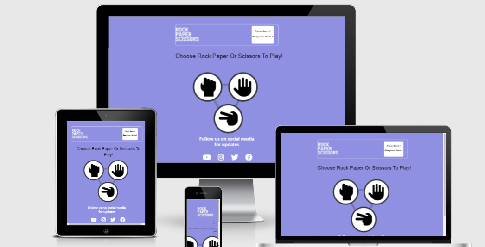
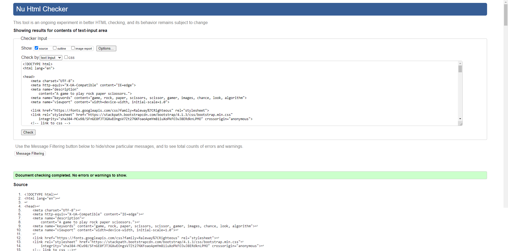
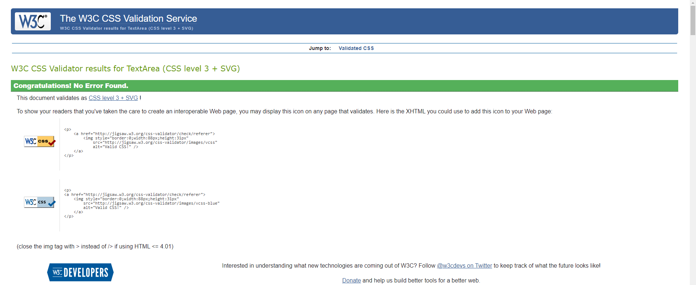
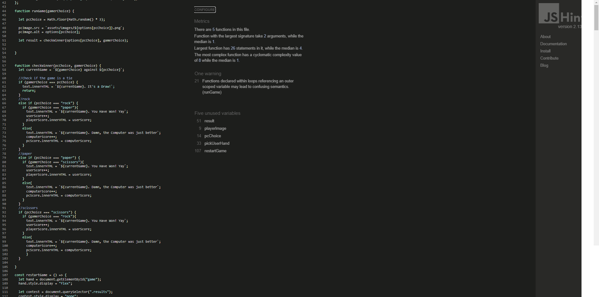
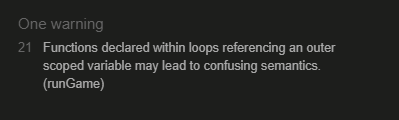

# My Second Product

This project really tested me, it is now 4am before my submission date and have work tomorrow,
this project isn't my proudest product, but nonetheless, I have poured all my knowledge of JS into this 
project. My project has its majors downs and a couple ups, but the main concern is the score counter
isn't working, the code is there for it to work, but it doesn't I can't understand.

My planning on this project was slightly all over the place, but I eventually achieved what I was 
looking to achieve, I did get help from a YouTube video, but every other bit of code like JS and the majority of 
CSS is my own work

# Features
## Existing features
* This page has a calm and neutral colour for the background, keeping everything simple and smooth.
* The user is immediately greeted with the task to undertake which is Choose Rock, Paper or Scissors
* This updated version now has a fully reactive site, with increasing score boards and function run again buttons.
* It also has interactive links at the bottom of the page, that allows you to open new tabs and search.

## Player Options
* There is an option for each of the three options available with reactive features on all buttons
* I have a select colour scheme with the "best colour match" according to top-rated colour matching sites

## Game results 
* When the user chooses an option, the screen changes with the option the player choose and the option the pc choose
* There is a change of symbols between transitions due to the first symbols not transferring to the transitioned page

## Testing
* I tested my site across different platforms, and it preformed perfectly across all
* I ran my HTML and CSS code through w3c validator and there were no errors or warnings in my code
* When I ran my JS code through a validator I received twenty Eight warnings but no errors, these errors from my understanding are from using an outdated version of code

* when I ran my website through lighthouse, I got back glowing reviews as follows

## bugs
* I would be lying if I said I didn't run into MAJOR mess-ups but somehow pulled myself out of the rough
* My biggest error was the transition after you click an option, I spent about 6 hours trying to figure it out but eventually got there.
* I did also have a problem with my submit button but aswel resolved that

#### unresolved problems
* There is no unresolved issue, but there is an error with GitHub itself, my media queries work perfectly on my GitHub page and then on my phone it doesn't work. Then I tried it on my friend's phone, and it worked properly. I'm not sure if it's a bug on my end or GitHubs end, but for me right now my site is fully responsive and reactive. I am also getting a warning when I run my code through Jshint, this is it (This isn't a game breaking or code ruining error).

 This is what it looks like for me.

 

 

# Deployment 
* This site was deployed using GitHub's built-in feature to allow the likes of me to upload pages for courses as such
* My site was uploaded at 3am, Thursday the 3rd of March 2022

## Credits

### content 
* I got the idea for the start of my JS code in the beginning video of the module
* My icons are from fontAwesome
* the design for my front page came from Clever Programmer on YouTube
* The fixed code was run through w3c validators
### media
* second set of rock paper scissors was taken from Clever Programmer on YouTube 
