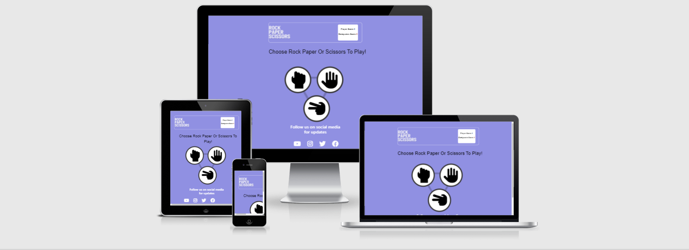
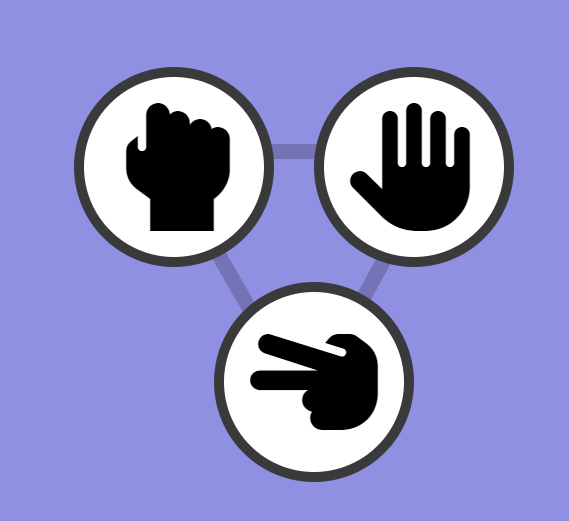
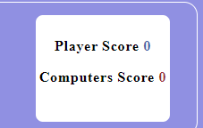
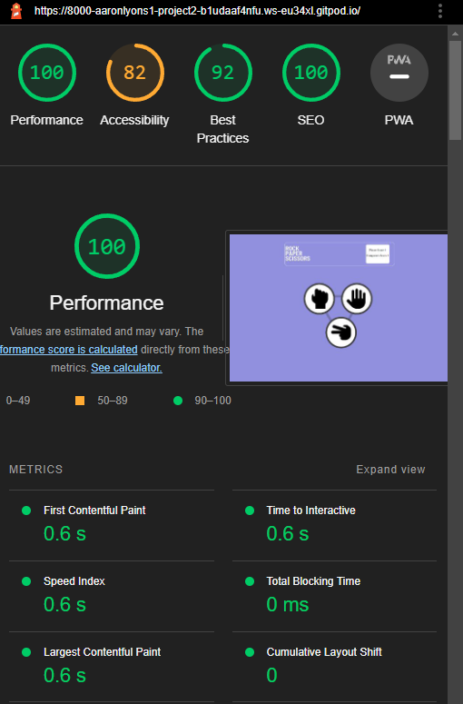

# My Second Product

This project really tested me, it is now 4am before my submission date and have work tommorow,
this project isn't my proudest product but none the less I have poured all my knowledge of js into this 
project. My project has its majors downs and a couple ups but the main conceren is the score counter
isn't working, the code is there for it to work but it doesn;t i can't understand.

My planning on this project was slightly all over the place but i eventually achieved what i was 
looking to achieve, i did get help from a youtube video but everyother bit of code like js and majority of 
css is my own work

# Features
## Exhisting features
* This page has a calm and nutral color for the background keeping everything symple and smooth.
* The user is immeditaly greeted with the task to unsertake which is Choose Rock, Paper or Scissors

## Player Options
* There is an option for each of the three options avalible with reactive features on all buttons
* I have a select color scheme with the "best color match" according to top rated color mathing sites

## Game results 
* When the user chooses an option the screen changes with the option the player choose and the option the pc choose
* There is a change of symbols between trasitions due to the first symbols not transferting to the transitioned page

## Testing
* I tested my site across different platforms and it preformed perfectly across all
* I ran my html and css code through w3c validator and there was no errors or warnins in my code
* When i ran my JS code through a validator I recieved twenty Eight warnings but no errors, these errors from my understanding are from using an outdated verion of code
* when i ran my webiste through lighthouse i got back glowing reviews as follows

## bugs
* I would be lying if i said i didn't run into MAJOR mess ups but somehow pulled myself out of the rough
* My biggest error was the transition after you click an option, i spent about 6 hours trying to figue it out but eventually got there.
* I did also have a problem with my submit button but aswel resolved that

#### unresolved problems
* My score board will not run, when the code is there it doesnt allow the rest of my code to run so i have it there just commented out ,

# Deployment 
* This site was deployed using githubs built in feature to allow the likes of me to upload pages for courses as such
* My site was uploaded at 3am thursday the 3rd of march 2022

## Credits

### content 
* I got the idea for the start of my JS code in the beginning video of the module
* My icons are from fontAwesome
* the design for my front page came from Clever Programer on youtube
* The fixed code was ran through w3c validators
### media
* second set of rock paper scissors was taken from Clever Programer on youtube
